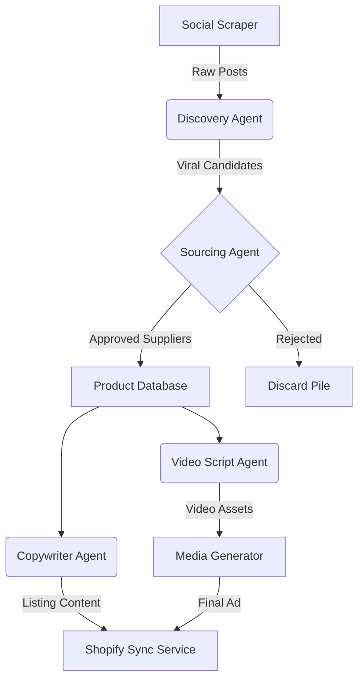

# System Architecture

## Overview
This project is an autonomous dropshipping engine that identifies viral trends, validates suppliers, generates marketing assets, and publishes products to Shopify. It uses a microservices approach orchestrated by Docker Compose.

## High-Level Data Flow

## Core Services

### 1. Scraper Service (`/services/scraper`)
- **Responsibility:** Ingest content from TikTok/Instagram Reels.
- **Tech:** Node.js, Puppeteer/Playwright (or Apify).
- **Output:** JSON stream of post metadata (views, likes, shares, comments).

### 2. Brain (Agent Orchestrator) (`/services/brain`)
- **Responsibility:** Manages the lifecycle of a product candidate.
- **Tech:** TypeScript, LangChain (optional), OpenAI API.
- **Logic:**
  - **Discovery:** Filters noise, scores virality.
  - **Sourcing:** Image searches AliExpress, verifies shipping < 15 days.
  - **Strategy:** Decides pricing and marketing angles.

### 3. Media Service (`/services/media`)
- **Responsibility:** Generates video ads and voiceovers.
- **Tech:** FFmpeg, ElevenLabs API, Creatomate/Remotion.
- **Output:** MP4 files uploaded to CDN/Shopify.

### 4. Database (`/infrastructure`)
- **Primary DB:** PostgreSQL (Product data, Order history, Agent logs).
- **Queue:** Redis (Job management for scraping and rendering tasks).

## Database Schema (Draft)

### `products`
| Column | Type | Description |
| :--- | :--- | :--- |
| `id` | UUID | Primary Key |
| `original_url` | TEXT | Link to viral post |
| `supplier_url` | TEXT | Link to AliExpress source |
| `status` | ENUM | DETECTED, VETTED, LISTED, REJECTED |
| `viral_score` | INT | 0-100 calculated score |
| `profit_margin` | DECIMAL | Projected profit per unit |

### `jobs`
| Column | Type | Description |
| :--- | :--- | :--- |
| `id` | UUID | Job ID |
| `type` | STRING | "SCRAPE", "VET", "RENDER" |
| `payload` | JSONB | Input parameters |
| `status` | ENUM | PENDING, PROCESSING, COMPLETED, FAILED |

## Tech Stack Versions
- **Node.js:** v20 (LTS)
- **PostgreSQL:** v16
- **Redis:** v7
- **Docker Compose:** v2.20+

